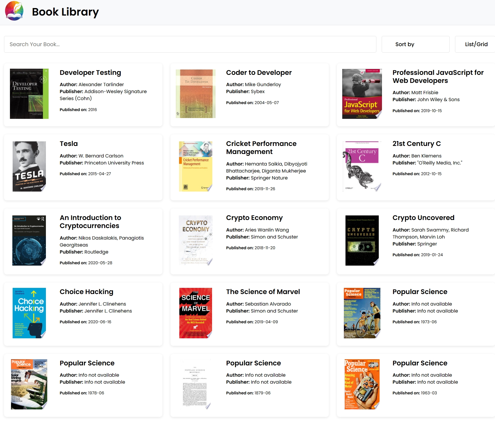

# 📚 Book Library Web App

## 📖 About the Project
This is a **Book Library Web App** that allows users to browse and search for books dynamically fetched from an external API. Users can sort books by name or date, switch between list and grid views, and explore book details.

## 🚀 Features
- 📡 Fetches books dynamically from **FreeAPI**.
- 🔍 **Search Functionality**: Users can search for books by title or author.
- 📑 **Sorting Options**: Sort books by name (A-Z, Z-A) and publication date (Newest to Oldest, Oldest to Newest).
- 📑 **View Toggle**: Switch between **list view** and **grid view**.
- 🎨 **Responsive UI**: Works smoothly on all devices.

## 🛠️ Technologies Used
- **HTML, CSS, JavaScript** for frontend development
- **FreeAPI** for fetching book data dynamically

## 📂 Project Structure
```
📂 Book-Library
 ├── 📄 index.html       # Main HTML file
 ├── 📄 style.css        # Styling for UI
 ├── 📄 script.js        # Main JavaScript file
 ├── 📄 Logo.png         # Logo 
 └── 📄 README.md        # Project documentation
```
## 📸 Screenshots

### 📖 List View  
The books are displayed in a vertical **list format** with details such as author, publisher, and published date.  


### 🔲 Grid View  
The books are displayed in a **grid layout**, making it easier to browse multiple books at once.  



### 🔍 Search Feature  
Users can search for books dynamically, filtering results based on the search input.  


## ⚙️ How to Run the Project
1. **Clone the Repository:**
   ```sh
   git clone https://github.com/yourusername/Book-Library.git
   ```
2. **Open `index.html` in a browser.**
3. Enjoy browsing books! 🎉

## 📌 Future Enhancements

⭐ Add user authentication and personalized book lists.

📥 Implement a "Favorite Books" feature.

🎨 Improve UI with animations and themes.

## 🌍 Deployment

This project is live! Check it out here:  
🔗 [Live Demo](https://book-library-yk4v.vercel.app/)
